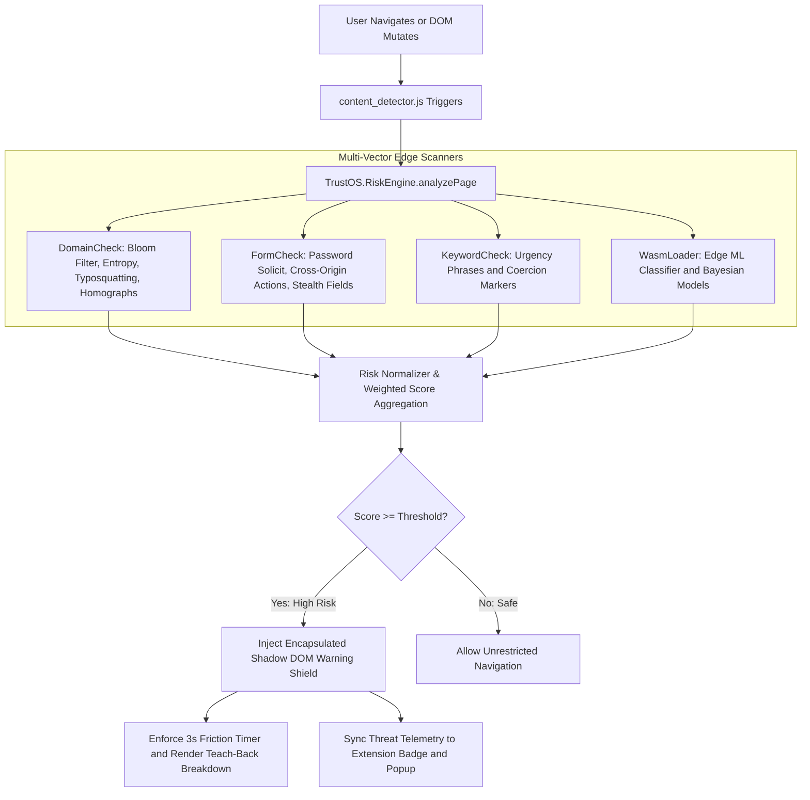

# TrustOS - Edge AI Phishing Detection & Ed-Tech Security Layer

<div align="center">

  
  
  
  
  
  

</div>

<br />

> **TrustOS** is a zero-trust, privacy-first browser security extension powered by on-device WebAssembly machine learning, Shannon entropy analysis, Levenshtein typosquatting detection, and O(1) bit-packed Bloom filter threat intelligence. Built to protect students, educators, and enterprise users from sophisticated credential harvesting and phishing attacks in real time without sending a single byte of telemetry off-device.

---

## Table of Contents

- [Overview and Problem Statement](#overview-and-problem-statement)
- [Key Architectural Features](#key-architectural-features)
- [Detection Flow and Heuristic Pipeline](#detection-flow-and-heuristic-pipeline)
- [Project Directory Structure](#project-directory-structure)
- [Modular Risk Engine Specification](#modular-risk-engine-specification)
- [Installation and Setup Guide](#installation-and-setup-guide)
- [Interactive Threat Simulation Playground](#interactive-threat-simulation-playground)
- [Automated Verification and Test Suite](#automated-verification-and-test-suite)
- [Privacy, Security and Permissions Blueprint](#privacy-security-and-permissions-blueprint)
- [Performance Benchmarks](#performance-benchmarks)
- [Development Roadmap](#development-roadmap)
- [Governance and Open Source](#governance-and-open-source)

---

## Overview and Problem Statement

### The Threat Landscape
As digital learning management systems (Canvas, Blackboard), Single-Sign-On (SSO) gateways, and financial aid portals become central to education and enterprise operations, credential harvesting has grown into the primary vector of cybercrime. Attackers routinely deploy cloned login portals, compound urgency lures, and typosquatted hostnames to harvest authentication credentials from unsuspecting users.

### The TrustOS Solution
TrustOS shifts the security boundary directly to the browser edge. Operating entirely within local browser memory, TrustOS dynamically evaluates DOM structure, credential inputs, linguistic urgency markers, domain entropy, and brand typosquatting in real time.

When high-probability phishing is detected:
1. **Encapsulated Shadow DOM Intervention:** TrustOS instantly pauses interaction with the page behind an unbypassable, glassmorphic warning overlay isolated inside a closed Shadow DOM boundary.
2. **Educational "Teach-Back" Interface:** Rather than silently blocking pages without context, TrustOS explains the exact threat factors (such as cross-origin form actions, domain homographs, or urgency pressure) to turn security incidents into active digital literacy moments.
3. **Behavioral Safety Friction:** Imposes an enforced 3-second countdown on override actions, breaking instinctive click-through habits and enforcing intentional user decisions.
4. **Session Whitelisting & Diagnostics:** Users can trust custom origins or export full JSON threat diagnostic reports with a single click.

---

## Key Architectural Features

- **Bit-Packed O(1) Bloom Filter:** Utilizes a compact 3-hash bitset (`Uint32Array`) to perform sub-millisecond lookups against thousands of compiled threat signatures.
- **Shannon Entropy and DGA Detection:** Calculates algorithmic entropy on domain string components to identify disposable and dynamically generated phishing hostnames.
- **Levenshtein Typosquatting Analyzer:** Evaluates character edit distance against registered high-value institutional and technology brands (Google, Canvas, Microsoft, GitHub, Zoom, PayPal).
- **IDN Homograph and Punycode Defense:** Detects Cyrillic and Greek lookalike character substitutions and `xn--` punycode domain spoofing.
- **Cross-Origin Form Action Audit:** Inspects password forms to verify whether credentials are submitted to external, unauthenticated endpoints.
- **Stealth / Obscured Field Detection:** Identifies hidden, zero-opacity, and off-screen inputs designed to invisibly capture keystrokes.
- **Edge WebAssembly and ML Classifier:** Runs on-device linguistic context classification to evaluate psychological urgency and threat severity.
- **MutationObserver Dynamic Scanner:** Debounced DOM observer instantly analyzes single-page applications (SPAs) and late-injected phishing modals.
- **Dynamic Tab Badge Telemetry:** Background service worker updates browser action badges (`SAFE`, `RISK`, `WARN`, `TRUST`) in real time per tab.
- **Interactive Popup Dashboard:** Multi-tab control panel featuring Overview status gauges, live Telemetry metrics, Allowlist management, and Sensitivity threshold customization.

---

## Detection Flow and Heuristic Pipeline



---

## Project Directory Structure

```text
trustos-project/
├── trustos-extension/              # Core Extension Directory (Manifest V3)
│   ├── scripts/                    # Modular Edge Analysis Engine
│   │   ├── config.js               # Heuristic weights, sensitivity levels & brand registry
│   │   ├── bloom_filter.js         # Bit-packed 3-hash O(1) Bloom filter engine
│   │   ├── threat_data.js          # Compiled edge threat signatures and feed
│   │   ├── domain_check.js         # Shannon entropy, typosquatting & homograph engine
│   │   ├── wasm_loader.js          # WebAssembly ML loader & on-device classifier
│   │   ├── keyword_check.js        # Multi-tier urgency & coercion phrase scanner
│   │   ├── form_check.js           # Cross-origin form audits & stealth field scanner
│   │   └── risk_engine.js          # Multi-vector risk aggregation & normalization
│   ├── wasm/
│   │   └── ml_engine.wasm          # Compiled edge WebAssembly ML binary
│   ├── background.js               # Service worker for badge states and allowlist sync
│   ├── content_detector.js         # Shadow DOM injector & MutationObserver listener
│   ├── manifest.json               # Chrome Extension Manifest V3 specification
│   ├── overlay.css                 # Dark-glassmorphism UI styles
│   ├── popup.html                  # Multi-tab extension control panel UI
│   └── popup.js                    # Popup telemetry & allowlist manager controller
├── tests/                          # Automated Verification Suite
│   ├── unit_tests.js               # Comprehensive unit tests for all modules
│   ├── test_runner.html            # Visual browser-based test execution UI
│   └── node_test_runner.js         # Headless CLI test execution runner
├── test-playground.html            # Interactive threat testing sandbox environment
├── CODE_OF_CONDUCT.md              # Community guidelines and standards
├── CONTRIBUTING.md                 # Contribution workflow and pull request guide
├── LICENSE                         # MIT Open Source License
├── README.md                       # Master project documentation
└── SECURITY.md                     # Security policy, threat model and disclosure
```

---

## Modular Risk Engine Specification

The normalized **Risk Score (0.00 to 1.00)** is computed across the following vectors:

| Heuristic Vector | Technical Methodology | Config Weight | Severity |
| :--- | :--- | :--- | :--- |
| **Bloom Filter Threat Match** | O(1) 3-hash bitset lookup against known malicious domains | `0.90` | Critical |
| **IDN Homograph / Punycode** | Detects Cyrillic lookalikes and `xn--` encoded domains | `0.65` | Critical |
| **Typosquatting Mimicry** | Levenshtein distance check against protected brand registry | `0.45` | High |
| **Cross-Origin Form Action** | Scans `<form action>` for mismatched destination origins | `0.40` | High |
| **Domain Mismatch** | Evaluates origin against trusted institution allowlist | `0.35` | High |
| **Shannon Entropy Anomaly** | Evaluates string randomness against algorithmic threshold (3.85) | `0.25` | Medium |
| **Wasm ML Context Classifier** | N-gram Bayesian scoring and coercion pattern detection | `0.25` | Medium |
| **Credential Solicitation** | Scans DOM for `<input type="password">` input elements | `0.20` | Medium |
| **Stealth / Obscured Inputs** | Checks for 0-opacity or off-screen hidden input elements | `0.20` | Medium |
| **Linguistic Urgency Phrases** | Regex boundary matching for account locks and financial holds | `0.15` | Medium |

### Sensitivity Profiles
Users can configure the trigger threshold in the popup settings:
- **Strict (0.40):** Maximum security for high-risk or novice users.
- **Balanced (0.60):** Recommended default balancing safety with low interruption.
- **Permissive (0.80):** Lowest interruption threshold for expert users.

---

## Installation and Setup Guide

### Prerequisites
- Google Chrome, Microsoft Edge, Brave, or any Chromium browser (v88+ with Manifest V3 support).

### Step-by-Step Installation

1. **Clone the Repository:**
   ```bash
   git clone https://github.com/Romil157/trustos-project.git
   ```

2. **Open the Extensions Page:**
   Navigate to `chrome://extensions` in your browser.

3. **Enable Developer Mode:**
   Toggle the **Developer Mode** switch in the top-right corner.

4. **Load the Unpacked Extension:**
   - Click the **Load unpacked** button.
   - Select the `trustos-extension` directory.

5. **Pin the Extension:**
   Pin **TrustOS Shield** to your browser toolbar to monitor live tab badges and telemetry.

---

## Interactive Threat Simulation Playground

TrustOS includes a standalone testing sandbox in `test-playground.html` enabling security researchers and judges to test detection capabilities without visiting malicious websites:

1. Open `test-playground.html` directly in your browser.
2. Click any of the one-click simulation buttons:
   - **Cloned Canvas LMS Login:** Injects cross-origin form actions and urgency banners.
   - **Scholarship & Financial Aid Lure:** Injects compound coercion phrases and account lock threats.
   - **Stealth Keystroke Harvest:** Injects hidden 0-opacity password inputs.
   - **Bloom Filter Signature Match:** Verifies instant threat database matching.
   - **Shannon Entropy Test:** Compares normal domain entropy vs. algorithmic DGA strings.
   - **Verified Educational Portal:** Confirms clean false-positive suppression on trusted domains.
3. Observe the live Shadow DOM intervention overlay, 3-second friction countdown, and the real-time diagnostic JSON output stream.

---

## Automated Verification and Test Suite

TrustOS features a complete unit test suite validating all core algorithms:

### Running Tests via CLI (Node.js)
```bash
node tests/node_test_runner.js
```

### Running Tests in Browser
Open `tests/test_runner.html` in your browser to view the visual test dashboard with real-time pass/fail metrics.

**Test Coverage Summary:**
- Bit-packed Bloom filter bit allocation, addition, and O(1) query accuracy.
- Shannon entropy string calculation and threshold distinction.
- Levenshtein distance matching and compound token typosquatting detection.
- IDN homograph and punycode Cyrillic lookalike identification.
- Form security audits and password field detection.
- Categorized linguistic keyword scanning.
- RiskEngine normalization, threshold gating, and session allowlist overrides.

---

## Privacy, Security and Permissions Blueprint

### Zero-Transmission Guarantee
- **No External Network Calls:** 100% of risk scoring executes locally on-device.
- **No Telemetry Collection:** 0 bytes of user data, passwords, or URLs leave the client.
- **Educational Compliance:** Fully compliant with **FERPA**, **GDPR**, and **COPPA** standards.

### Manifest V3 Permissions Justification

| Permission | Technical Requirement Justification |
| :--- | :--- |
| `activeTab` | Required to scan active tab DOM elements for phishing markers when evaluating security. |
| `storage` | Stores user configuration, sensitivity settings, and trusted allowlists locally in browser storage. |
| `declarativeNetRequest` | Enables network-level blocking of verified phishing origins without broad host interception. |

---

## Performance Benchmarks

- **Detection Latency:** `< 50ms` (Synchronous local JavaScript and Wasm heuristic evaluation).
- **Memory Footprint:** `< 12MB RAM` (Pure Vanilla JavaScript and bit-packed Uint32Array bitsets).
- **Network Egress:** `0 Bytes` (Zero cloud telemetry overhead).
- **Friction Impact:** `3-Second` enforced wait timer on proceed overrides, significantly reducing impulsive credential submission.

---

## Development Roadmap

- [x] **Phase 1:** Core heuristic risk engine and Shadow DOM intervention UI.
- [x] **Phase 2:** Bit-packed 3-hash Bloom filter for O(1) instant threat matching.
- [x] **Phase 3:** Shannon entropy analysis for algorithmic DGA domain detection.
- [x] **Phase 4:** Levenshtein distance typosquatting and IDN homograph Cyrillic defense.
- [x] **Phase 5:** Multi-tab popup control panel with live telemetry and allowlist management.
- [x] **Phase 6:** Interactive threat testing playground and automated unit test suite.
- [ ] **Phase 7 (Upcoming):** Enterprise policy template distribution and remote Bloom filter delta updates.

---

## Governance and Open Source

- **License:** Distributed under the [MIT License](LICENSE).
- **Security Policy:** Detailed threat model and vulnerability disclosure guidelines in [SECURITY.md](SECURITY.md).
- **Contributing:** Guidelines and pull request workflows in [CONTRIBUTING.md](CONTRIBUTING.md).
- **Code of Conduct:** Community standards defined in [CODE_OF_CONDUCT.md](CODE_OF_CONDUCT.md).

---

<div align="center">
  <sub>Built by the TrustOS Team to safeguard digital learning environments.</sub>
</div>
